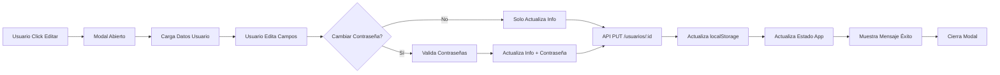

# 👤 Funcionalidad de Editar Perfil - Rutinia

## 📋 Descripción General

Se ha implementado una funcionalidad completa para que los usuarios puedan editar su información de perfil desde la aplicación. Esta funcionalidad incluye un modal moderno y responsive que permite actualizar datos personales y cambiar la contraseña.

## ✨ Características Implementadas

### 🎨 Modal de Edición de Perfil
- **Diseño Moderno**: Modal con fondo oscuro semitransparente y diseño responsive
- **Modo Oscuro**: Soporte completo para tema claro y oscuro
- **Scrollable**: El contenido se puede desplazar en dispositivos con pantallas pequeñas
- **Animaciones**: Transiciones suaves en todos los elementos interactivos

### 📝 Campos Editables

1. **Información Personal**
   - Nombre
   - Apellido
   - Correo electrónico

2. **Cambio de Contraseña (Opcional)**
   - Contraseña actual (validación)
   - Nueva contraseña (mínimo 6 caracteres)
   - Confirmar nueva contraseña (validación de coincidencia)
   - Checkbox para activar/desactivar cambio de contraseña
   - Botones de mostrar/ocultar contraseña en cada campo

### ✅ Validaciones Implementadas

- **Nombre**: Campo requerido
- **Apellido**: Campo requerido
- **Correo**: Formato válido de email
- **Contraseña Actual**: Verificación contra la contraseña almacenada
- **Nueva Contraseña**: Mínimo 6 caracteres
- **Confirmar Contraseña**: Debe coincidir con la nueva contraseña

### 🔒 Seguridad

- Validación de contraseña actual antes de permitir cambios
- Verificación de coincidencia de contraseñas nuevas
- Prevención de cierre accidental del modal durante guardado
- Manejo de errores con mensajes descriptivos

## 📁 Archivos Modificados/Creados

### Nuevo Archivo
```
src/frontend-react/src/components/EditProfile.jsx
```
Componente modal completo para editar el perfil del usuario.

### Archivos Modificados

1. **`src/frontend-react/src/App.jsx`**
   - Importado componente `EditProfile`
   - Agregado estado `showEditProfileModal`
   - Creada función `handleUpdateProfile()`
   - Agregada prop `onEditProfile` al componente `Sidebar`
   - Renderizado del modal `<EditProfile />`

2. **`src/frontend-react/src/components/Sidebar.jsx`**
   - Agregada prop `onEditProfile`
   - Conectado botón "Editar perfil" con función `onClick={onEditProfile}`

## 🚀 Cómo Usar

### Para Usuarios

1. **Abrir el Modal**
   - Click en el botón "Editar perfil" en el sidebar
   - El modal se abrirá con los datos actuales pre-cargados

2. **Editar Información**
   - Modifica nombre, apellido o correo según necesites
   - Si deseas cambiar la contraseña:
     - Marca el checkbox "Cambiar contraseña"
     - Ingresa tu contraseña actual
     - Ingresa y confirma tu nueva contraseña

3. **Guardar Cambios**
   - Click en "Guardar Cambios"
   - Los datos se actualizarán en el backend
   - El localStorage se actualizará automáticamente
   - Verás un mensaje de éxito

4. **Cancelar**
   - Click en "Cancelar" o en la X para cerrar sin guardar
   - Los cambios no se aplicarán

### Para Desarrolladores

#### Integración en Otros Componentes

```jsx
import EditProfile from './components/EditProfile';

// En tu componente
const [showEditProfile, setShowEditProfile] = useState(false);
const [usuario, setUsuario] = useState(null);

// Función para actualizar usuario
const handleUpdateProfile = (updatedUser) => {
  setUsuario(updatedUser);
  // Lógica adicional...
};

// Render
<EditProfile
  isOpen={showEditProfile}
  onClose={() => setShowEditProfile(false)}
  usuario={usuario}
  onUpdateSuccess={handleUpdateProfile}
/>
```

#### Props del Componente

| Prop | Tipo | Descripción |
|------|------|-------------|
| `isOpen` | `boolean` | Controla la visibilidad del modal |
| `onClose` | `function` | Callback para cerrar el modal |
| `usuario` | `object` | Objeto con los datos del usuario actual |
| `onUpdateSuccess` | `function` | Callback ejecutado tras actualizar exitosamente |

#### Estructura del Objeto Usuario

```javascript
{
  _id: "string",           // ID del usuario en MongoDB
  nombre: "string",         // Nombre del usuario
  apellido: "string",       // Apellido del usuario
  correo: "string",         // Email del usuario
  clave: "string",          // Contraseña (en texto plano - mejorar en producción)
  tema: "light" | "dark"    // Preferencia de tema
}
```

## 🔄 Flujo de Actualización



## 🎯 API Utilizada

### Endpoint de Actualización
```
PUT /api/usuarios/:id
```

### Cuerpo de la Petición
```json
{
  "nombre": "string",
  "apellido": "string",
  "correo": "string",
  "clave": "string",
  "tema": "light" | "dark"
}
```

### Respuesta Exitosa
```json
{
  "_id": "string",
  "nombre": "string",
  "apellido": "string",
  "correo": "string",
  "clave": "string",
  "tema": "light" | "dark"
}
```

## 🐛 Manejo de Errores

### Errores Comunes

1. **Contraseña Actual Incorrecta**
   - Mensaje: "Contraseña actual incorrecta"
   - Se muestra debajo del campo de contraseña actual

2. **Contraseñas No Coinciden**
   - Mensaje: "Las contraseñas no coinciden"
   - Se muestra debajo del campo de confirmación

3. **Error de Conexión**
   - Mensaje: "Error al actualizar el perfil"
   - Se muestra en la parte superior del modal

4. **Campos Vacíos**
   - Mensajes específicos por campo
   - Ejemplo: "El nombre es requerido"

## 📱 Responsive Design

### Mobile (< 640px)
- Modal ocupa 95% del ancho
- Padding reducido
- Fuente legible en pantallas pequeñas
- Scroll vertical habilitado

### Tablet (640px - 1024px)
- Modal con ancho máximo de 28rem
- Mejor espaciado entre elementos

### Desktop (> 1024px)
- Modal centrado con máximo 28rem
- Espaciado óptimo
- Transiciones suaves

## 🎨 Temas

### Modo Claro
- Fondo blanco
- Texto gris oscuro
- Botones con gradiente morado-índigo

### Modo Oscuro
- Fondo gris oscuro (gray-800)
- Texto blanco/gris claro
- Mismos gradientes adaptados
- Bordes sutiles

## 🔮 Mejoras Futuras

### Corto Plazo
- [ ] Validación de email en tiempo real
- [ ] Indicador de fuerza de contraseña
- [ ] Confirmación antes de guardar cambios críticos
- [ ] Preview de cambios antes de guardar

### Mediano Plazo
- [ ] Subir foto de perfil
- [ ] Cambio de tema desde el modal
- [ ] Configuración de notificaciones
- [ ] Preferencias de privacidad

### Largo Plazo
- [ ] Autenticación de dos factores
- [ ] Vinculación con redes sociales
- [ ] Historial de cambios
- [ ] Recuperación de cuenta

## 🔐 Consideraciones de Seguridad

### ⚠️ Importante para Producción

1. **Encriptación de Contraseñas**
   - Actualmente se almacenan en texto plano
   - Implementar bcrypt o Argon2 en el backend
   - Nunca enviar contraseñas en texto plano

2. **Tokens de Autenticación**
   - Implementar JWT para sesiones
   - Renovación automática de tokens
   - Invalidación de tokens antiguos

3. **HTTPS**
   - Forzar conexión segura en producción
   - Prevenir ataques man-in-the-middle

4. **Rate Limiting**
   - Limitar intentos de cambio de contraseña
   - Prevenir ataques de fuerza bruta

5. **Validación Backend**
   - No confiar solo en validación frontend
   - Validar todos los campos en el servidor

## 📞 Soporte

Si encuentras algún problema o tienes sugerencias:
1. Revisa los mensajes de error en consola
2. Verifica que el backend esté corriendo
3. Asegúrate de que el usuario esté autenticado
4. Consulta este README para referencias

---

**Desarrollado con ❤️ para Rutinia**
