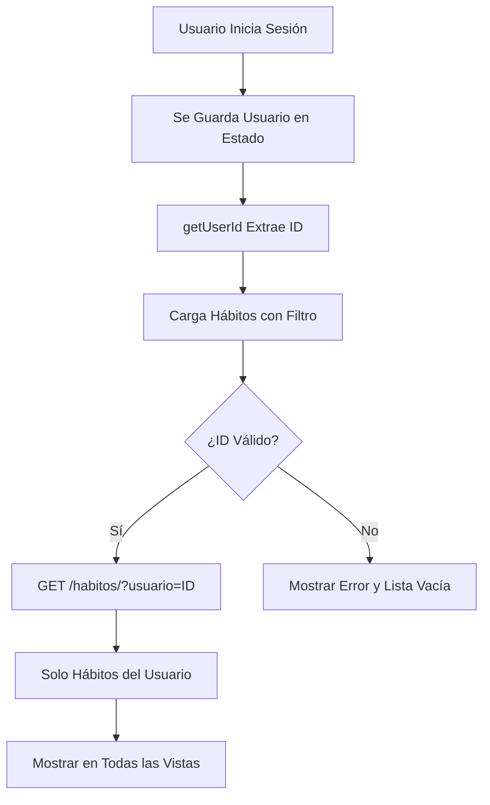

# 🔐 Filtrado de Hábitos por Usuario - Rutinia

## 📋 Descripción

Se ha implementado un sistema de filtrado de hábitos para que cada usuario **solo pueda ver y gestionar sus propios hábitos**. Esto asegura la privacidad y seguridad de los datos de cada usuario en la aplicación.

## ✨ Cambios Implementados

### 1. **Función `getUserId()`**
Se creó una función auxiliar para obtener el ID del usuario autenticado de forma consistente:

```javascript
const getUserId = () => {
  return usuario?.id || usuario?._id || null;
};
```

Esta función maneja diferentes formatos de ID que puede devolver el backend (MongoDB puede usar `id` o `_id`).

### 2. **Carga de Hábitos Filtrada**
La función `loadHabitsFromBackend()` ahora filtra los hábitos por usuario:

```javascript
const loadHabitsFromBackend = async () => {
  const userId = getUserId();
  
  if (!userId) {
    console.error('❌ No se encontró el ID del usuario');
    setHabitsData([]);
    return;
  }
  
  // Obtener solo los hábitos del usuario actual
  const backendHabits = await api.getHabitos({ usuarioId: userId });
  
  // ... resto del código
};
```

**Resultado:** Solo se cargan los hábitos que pertenecen al usuario autenticado.

### 3. **Creación de Hábitos con Usuario**
La función `handleCreateHabit()` ahora asocia automáticamente el nuevo hábito con el usuario:

```javascript
const handleCreateHabit = async (newHabitData) => {
  const userId = getUserId();
  
  if (!userId) {
    showErrorMessage('No se pudo identificar el usuario...');
    return;
  }
  
  const backendData = api.mapHabitoToBackend(newHabitData, userId);
  // ... resto del código
};
```

**Resultado:** Cada hábito creado se asocia automáticamente con el usuario que lo crea.

### 4. **Edición de Hábitos con Usuario**
La función `handleEditHabit()` también incluye la validación de usuario:

```javascript
const handleEditHabit = async (editedHabitData) => {
  const userId = getUserId();
  
  if (!userId) {
    showErrorMessage('No se pudo identificar el usuario...');
    return;
  }
  
  const backendData = api.mapHabitoToBackend(editedHabitData, userId);
  // ... resto del código
};
```

**Resultado:** Solo se pueden editar los hábitos del usuario autenticado.

### 5. **Eliminación de ID Temporal**
Se eliminó la constante `TEMP_USER_ID` que se usaba para pruebas:

```javascript
// ❌ ELIMINADO
const TEMP_USER_ID = '68ea57f5fc52f3058c8233ab';

// ✅ REEMPLAZADO POR
const getUserId = () => {
  return usuario?.id || usuario?._id || null;
};
```

## 🎯 Impacto en las Vistas

### **Vista: Hábitos del Día**
- ✅ Solo muestra los hábitos del usuario autenticado que aplican para hoy
- ✅ Los hábitos de otros usuarios NO aparecen

### **Vista: Calendario**
- ✅ Solo muestra los registros de hábitos del usuario autenticado
- ✅ Las estadísticas y racha son solo del usuario actual

### **Vista: Mis Hábitos**
- ✅ Lista completa de hábitos del usuario autenticado
- ✅ Categorías y filtros solo muestran los hábitos del usuario

### **Vista: Progreso**
- ✅ Estadísticas calculadas solo con los hábitos del usuario
- ✅ Gráficos y porcentajes basados únicamente en datos del usuario

## 🔒 Seguridad

### **Frontend**
- ✅ Filtrado de hábitos por `usuarioId` en todas las peticiones GET
- ✅ Validación de usuario antes de crear o editar hábitos
- ✅ Mensajes de error cuando no se puede identificar al usuario

### **Backend** (Requiere configuración adicional)
Para una seguridad completa, asegúrate de que el backend también valide:

```python
# En el ViewSet de Hábitos (Django)
def get_queryset(self):
    # Filtrar por usuario autenticado
    return Habito.objects.filter(usuario=self.request.user)

def perform_create(self, serializer):
    # Asociar con usuario autenticado
    serializer.save(usuario=self.request.user)
```

## 🚀 Flujo de Uso



## 📊 Ejemplos

### Ejemplo 1: Usuario A
```javascript
// Usuario A (ID: 123abc)
{
  id: '123abc',
  nombre: 'María',
  apellido: 'García'
}

// Hábitos visibles:
- Hacer ejercicio (creado por María)
- Leer 30 minutos (creado por María)
- Meditar (creado por María)

// NO verá:
- Estudiar programación (creado por Juan)
- Tocar guitarra (creado por Pedro)
```

### Ejemplo 2: Usuario B
```javascript
// Usuario B (ID: 456def)
{
  id: '456def',
  nombre: 'Juan',
  apellido: 'Pérez'
}

// Hábitos visibles:
- Estudiar programación (creado por Juan)
- Beber agua (creado por Juan)

// NO verá:
- Hacer ejercicio (creado por María)
- Leer 30 minutos (creado por María)
```

## 🧪 Pruebas

### Probar el Filtrado

1. **Crear Usuario 1:**
   - Registrarse con: usuario1@test.com
   - Crear 3 hábitos

2. **Cerrar Sesión**

3. **Crear Usuario 2:**
   - Registrarse con: usuario2@test.com
   - Crear 2 hábitos

4. **Verificar:**
   - Usuario 2 solo ve sus 2 hábitos
   - Usuario 2 NO ve los 3 hábitos del Usuario 1

5. **Cambiar de Usuario:**
   - Cerrar sesión del Usuario 2
   - Iniciar sesión con Usuario 1
   - Verificar que solo ve sus 3 hábitos originales

### Consola del Navegador

Abre la consola (F12) y busca estos mensajes:

```
🔍 Cargando hábitos para el usuario: 123abc456def789
✅ Se encontraron 5 hábitos del usuario
```

## 🐛 Solución de Problemas

### Problema: "No se encontraron hábitos"
**Causa:** El usuario no tiene ID o no hay hábitos creados.

**Solución:**
1. Verifica que el usuario esté autenticado
2. Revisa la consola para ver el ID del usuario
3. Crea al menos un hábito para el usuario actual

### Problema: "Veo hábitos de otros usuarios"
**Causa:** El backend no está filtrando correctamente.

**Solución:**
1. Verifica que el backend tenga el filtro por usuario
2. Revisa los logs del backend
3. Comprueba que la petición incluya `?usuario=ID`

### Problema: "No se pueden crear hábitos"
**Causa:** No se puede identificar el usuario.

**Solución:**
1. Cierra sesión y vuelve a iniciar sesión
2. Verifica que el usuario se guarde correctamente en localStorage
3. Revisa la consola del navegador para errores

## 📝 Notas Importantes

### ⚠️ localStorage
Los hábitos completados se siguen guardando en localStorage por usuario. Esto es temporal y debería moverse al backend en una versión futura.

### 🔄 Sincronización
Cada vez que un usuario inicia sesión:
1. Se carga su información
2. Se obtiene su ID
3. Se cargan solo sus hábitos
4. Se sincronizan sus registros diarios

### 🚨 Sin ID
Si por alguna razón no se puede obtener el ID del usuario:
- La aplicación mostrará un mensaje de error
- No se cargarán hábitos
- Se pedirá al usuario que inicie sesión nuevamente

## 🔮 Mejoras Futuras

### Corto Plazo
- [ ] Mover completedHabits a backend (actualmente en localStorage)
- [ ] Implementar middleware de autenticación en backend
- [ ] Agregar permisos de usuario en Django

### Mediano Plazo
- [ ] Implementar JWT para autenticación
- [ ] Caché de hábitos por usuario
- [ ] Sincronización offline

### Largo Plazo
- [ ] Hábitos compartidos entre usuarios
- [ ] Grupos y equipos
- [ ] Roles y permisos avanzados

## ✅ Checklist de Implementación

- [x] Crear función `getUserId()`
- [x] Modificar `loadHabitsFromBackend()` para filtrar por usuario
- [x] Actualizar `handleCreateHabit()` con validación de usuario
- [x] Actualizar `handleEditHabit()` con validación de usuario
- [x] Eliminar `TEMP_USER_ID`
- [x] Agregar logs de debugging
- [x] Agregar manejo de errores
- [x] Probar en todas las vistas
- [x] Documentar cambios

---

**Desarrollado con 🔒 para mantener tus datos privados en Rutinia**
