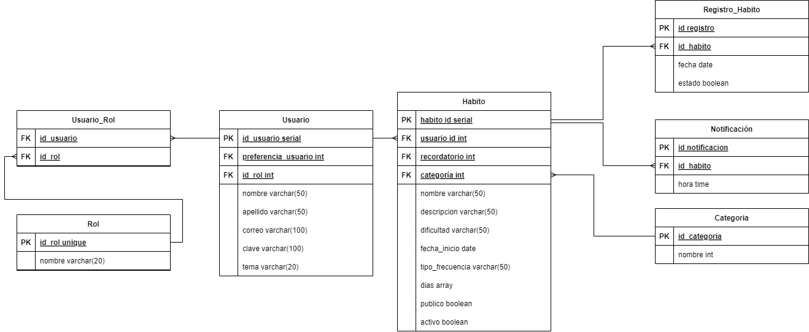

# 🗓️ Rutinia - Gestor de Hábitos

[](https://www.python.org/)
[](https://www.djangoproject.com/)
[](https://reactjs.org/)
[](https://nodejs.org/)
[](https://www.mongodb.com/cloud/atlas)
[](LICENSE)

Aplicación web moderna para la gestión de hábitos, diseñada para ayudar a los usuarios a crear, organizar y seguir sus rutinas de forma intuitiva mediante calendarios interactivos, seguimiento diario y sincronización en la nube.

### 🎯 Características Principales

✨ **Gestión Completa de Hábitos** - Crea, edita y elimina hábitos personalizados  
📅 **Frecuencias Flexibles** - Diaria, semanal o mensual  
📆 **Calendario Interactivo** - Visualiza tu progreso mes a mes  
✅ **Seguimiento Diario** - Marca hábitos completados cada día  
🎨 **Personalización** - Elige iconos y colores para cada hábito  
🌙 **Modo Oscuro** - Tema claro y oscuro  
📱 **Responsive** - Funciona en móvil, tablet y desktop  
☁️ **Nube** - Sincronización automática con MongoDB Atlas  

👉 La documentación completa del proyecto está disponible en la [Wiki](https://github.com/JuanFernandoBallesterosMaciasUIS/Rutinia-1.0/wiki). 

---

## 📑 Tabla de Contenidos

- [⚙️ Instalación y Configuración](#️-instalación-y-configuración)
  - [📦 Requisitos Previos](#-requisitos-previos)
  - [🚀 Instalación Paso a Paso](#-instalación-paso-a-paso)
  - [▶️ Ejecución del Proyecto](#️-ejecución-del-proyecto)
  - [🔧 Solución de Problemas](#-solución-de-problemas)
- [🛠️ Tecnologías Utilizadas](#️-tecnologías-utilizadas-versión-actual)
- [📂 Estructura del Proyecto](#-estructura-del-proyecto-versión-actual)
- [🗃️ Arquitectura de Datos](#️-arquitectura-de-datos)
- [✨ Características](#-características-versión-actual)
- [🤝 Contribución](#-contribución)
- [👥 Equipo de Desarrollo](#-equipo-de-desarrollo)
- [📧 Contacto y Soporte](#-contacto-y-soporte)

---

## ⚙️ Instalación y configuración

### 📦 Requisitos Previos

Antes de comenzar, asegúrate de tener instalado:

- **Node.js** 20.15.1 o superior - [Descargar](https://nodejs.org/)
- **Python** 3.11 o superior - [Descargar](https://www.python.org/downloads/)
- **Git** - [Descargar](https://git-scm.com/downloads)
- Conexión a Internet (para MongoDB Atlas)

### 🚀 Instalación Paso a Paso

#### 1️⃣ Clonar el repositorio

```bash
git clone https://github.com/JuanFernandoBallesterosMaciasUIS/Rutinia-1.0.git
cd Rutinia-1.0
```

#### 2️⃣ Configurar Backend (Django + MongoDB)

```bash
# Navegar a la carpeta del backend
cd src/backend-django

# Crear entorno virtual
python -m venv venv

# Activar entorno virtual
# Windows PowerShell:
.\venv\Scripts\Activate.ps1
# Windows CMD:
.\venv\Scripts\activate.bat
# Linux/Mac:
source venv/bin/activate

# Instalar dependencias
pip install -r requeriments.txt
```

#### 3️⃣ Crear Datos de Prueba (Opcional)

```bash
cd rutinia
..\venv\Scripts\python.exe create_sample_habits.py
```

Esto creará:
- 1 usuario de prueba (demo@rutinia.com)
- 1 categoría (Salud)
- 3 hábitos de ejemplo

#### 4️⃣ Configurar Frontend (React + Vite)

```bash
# Desde la raíz del proyecto
cd src/frontend-react

# Instalar dependencias
npm install
```

### ▶️ Ejecución del Proyecto

#### Opción 1: Script Automático (Windows - Recomendado)

```bash
cd src
.\start-all.bat
```

Este script abre automáticamente:
- ✅ Django en `http://localhost:8000`
- ✅ React en `http://localhost:5173`

#### Opción 2: Manual (Dos Terminales)

**Terminal 1 - Backend:**
```bash
cd src/backend-django
.\venv\Scripts\Activate.ps1  # Windows
# source venv/bin/activate   # Linux/Mac
cd rutinia
python manage.py runserver
```

**Terminal 2 - Frontend:**
```bash
cd src/frontend-react
npm run dev
```

### 🌐 Acceder a la Aplicación

- **Aplicación Web:** `http://localhost:5173`
- **API REST:** `http://localhost:8000/api/`
- **Desde celular (misma WiFi):** Buscar URL "Network" en la terminal de React

### 📡 API Endpoints Principales

| Método | Endpoint | Descripción |
|--------|----------|-------------|
| `GET` | `/api/habitos/` | Listar todos los hábitos |
| `POST` | `/api/habitos/` | Crear nuevo hábito |
| `GET/PUT/DELETE` | `/api/habitos/{id}/` | Ver/Editar/Eliminar hábito |
| `GET/POST` | `/api/categorias/` | Gestionar categorías |
| `GET/POST` | `/api/registros/` | Registros de hábitos completados |

### 🔧 Solución de Problemas

**Error: "ModuleNotFoundError: No module named 'django'"**
```bash
cd src/backend-django
.\venv\Scripts\Activate.ps1
pip install -r requeriments.txt
```

**Error: "CORS policy blocked"**
- Verifica que `django-cors-headers` esté instalado
- Confirma que `'corsheaders'` esté en `INSTALLED_APPS` en `settings.py`

**No se muestran hábitos:**
- Verifica que Django esté corriendo: `http://localhost:8000/api/habitos/`
- Revisa la consola del navegador (F12)
- Ejecuta el script de datos de prueba

📖 **Documentación Completa:** Ver [`src/COMO_CORRER_PROYECTO.md`](src/COMO_CORRER_PROYECTO.md)

---

## 🛠️ Tecnologías utilizadas (Versión Actual)

### Backend
- **Django** 5.2.7
- **Django REST Framework** 3.16.1
- **MongoEngine** 0.29.1 (MongoDB Atlas)
- **django-cors-headers** 4.9.0

### Frontend
- **React** 19.1.1
- **Vite** 5.4.11
- **Tailwind CSS** 3.4.18
- **Material Icons**

### Legacy (Spring Boot)
- **Spring Boot** (Java) - Implementación anterior
- **MySQL** - Base de datos relacional anterior

---

## 📂 Estructura del proyecto (Versión Actual)

```
Rutinia-1.0/
├── src/
│   ├── backend-django/          # Backend Django + MongoDB
│   │   ├── rutinia/
│   │   │   ├── core/            # App principal (models, views, serializers)
│   │   │   ├── rutinia/         # Configuración (settings.py, urls.py)
│   │   │   ├── manage.py
│   │   │   └── create_sample_habits.py  # Script de datos de prueba
│   │   ├── venv/                # Entorno virtual Python
│   │   └── requeriments.txt
│   │
│   ├── frontend-react/          # Frontend React
│   │   ├── src/
│   │   │   ├── components/      # Componentes React
│   │   │   ├── services/        # API y localStorage
│   │   │   ├── data/
│   │   │   ├── App.jsx
│   │   │   └── main.jsx
│   │   ├── package.json
│   │   └── vite.config.js
│   │
│   ├── backend-springboot/      # Backend Spring Boot (Legacy)
│   ├── start-all.bat            # Script de inicio (Windows)
│   └── COMO_CORRER_PROYECTO.md
│
├── docs/                        # Documentación y diagramas
├── tests/                       # Pruebas
└── README.md
```

---

## 🗃️ Arquitectura de Datos

### Modelos Principales (MongoDB)

**Usuario**
- nombre, apellido, correo (único)
- clave, tema, rol

**Habito**
- usuario (referencia), categoria (referencia)
- nombre, descripcion, dificultad
- fecha_inicio, tipo_frecuencia, dias[]
- publico, activo, notificaciones[]

**Categoria**
- nombre

**RegistroHabito**
- habito (referencia), fecha, estado

### Almacenamiento Híbrido
- **MongoDB:** Datos de negocio (hábitos, usuarios, registros)
- **localStorage:** Preferencias visuales (iconos, colores)

---

## ✨ Características (Versión Actual)

- ✅ Crear y gestionar hábitos personalizados
- 📅 Frecuencia: diaria, semanal, mensual
- ✅ Marcar hábitos como completados
- 📆 Vista de calendario interactivo
- 📊 Vista de "Mis Hábitos" con filtros
- 🎨 Modo oscuro/claro
- � Responsive (móvil, tablet, desktop)
- 🌐 Acceso desde dispositivos en red local
- 💾 Sincronización automática con MongoDB
- 🏷️ Categorización de hábitos

---

## 🎬 Demo y Capturas

> 📸 Agrega capturas de pantalla de la aplicación en `docs/screenshots/` para mostrar:
> - Vista principal con calendario
> - Sección "Mis Hábitos"
> - Modal de creación de hábito
> - Modo oscuro/claro

---

## 🗺️ Roadmap

### ✅ Versión 1.0 (Actual)
- [x] Migración de Django + MongoDB
- [x] Frontend React con Vite
- [x] CRUD completo de hábitos
- [x] Calendario interactivo
- [x] Modo oscuro/claro
- [x] Responsive design

### 🚧 Versión 1.1 (Próximamente)
- [ ] Autenticación de usuarios (login/registro)
- [ ] Perfil de usuario
- [ ] Edición de categorías desde UI
- [ ] Estadísticas y gráficos de progreso
- [ ] Sistema de recordatorios

### 🔮 Versión 2.0 (Futuro)
- [ ] Modo offline con sincronización
- [ ] Exportar datos a PDF/CSV
- [ ] Compartir hábitos con otros usuarios
- [ ] Gamificación (logros, rachas)
- [ ] PWA (Progressive Web App)

---

## 🤝 Contribución

¡Las contribuciones son bienvenidas! Si deseas colaborar con el proyecto:

### Pasos para contribuir:

1. **Fork** el proyecto
2. **Clona** tu fork: `git clone https://github.com/TU_USUARIO/Rutinia-1.0.git`
3. **Crea una rama** para tu feature: `git checkout -b feature/nueva-funcionalidad`
4. **Realiza tus cambios** siguiendo las convenciones del proyecto
5. **Commit** con mensajes descriptivos: `git commit -m 'feat: agregar funcionalidad X'`
6. **Push** a tu rama: `git push origin feature/nueva-funcionalidad`
7. **Abre un Pull Request** explicando tus cambios

### Convenciones de Commits:

- `feat:` Nueva funcionalidad
- `fix:` Corrección de errores
- `docs:` Cambios en documentación
- `style:` Formateo, espacios, etc.
- `refactor:` Refactorización de código
- `test:` Agregar o modificar tests

> 📖 Para más detalles, consulta la sección [Cómo Colaborar](https://github.com/JuanFernandoBallesterosMaciasUIS/Rutinia-1.0/wiki) en la Wiki.

---

## 👥 Equipo de Desarrollo

- [Helbert Alexeiv Correa Uribe](https://github.com/Alvoid101) – Product Owner y Equipo de Desarrollo
- [Juan Fernando Ballesteros Macias](https://github.com/JuanFernandoBallesterosMaciasUIS) – Scrum Master y Equipo de Desarrollo
- Camilo Ivan Palacio Perez – Equipo de Desarrollo
- [Julian Javier Lizcano Villarreal](https://github.com/jjlizcano) – Scrum Master y Equipo de Desarrollo
- Carlos Eduardo Ayala Moreno – Product Owner y Equipo de Desarrollo
- Harold Esteban Duran Osma – Equipo de Desarrollo

## 📧 Contacto y Soporte

- 📝 Abre un [Issue](https://github.com/JuanFernandoBallesterosMaciasUIS/Rutinia-1.0/issues) para reportar bugs o solicitar features
- 📖 Consulta la [Wiki](https://github.com/JuanFernandoBallesterosMaciasUIS/Rutinia-1.0/wiki) para documentación detallada
- 🤝 Lee la guía de [Contribución](https://github.com/JuanFernandoBallesterosMaciasUIS/Rutinia-1.0/wiki) antes de hacer Pull Requests

## 📊 Estado del Proyecto

**🚀 Versión:** 1.0 (Django + React + MongoDB)  
**📅 Última Actualización:** Enero 2025  
**🔧 Estado:** En Desarrollo Activo  
**🎓 Contexto:** Proyecto académico - UIS (Universidad Industrial de Santander)

---

## Diseño de base de datos relacional (Legacy)

